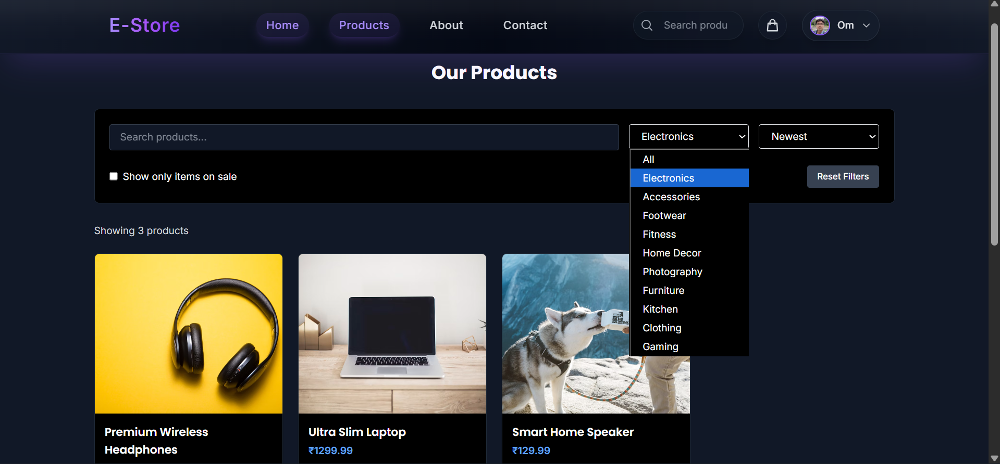
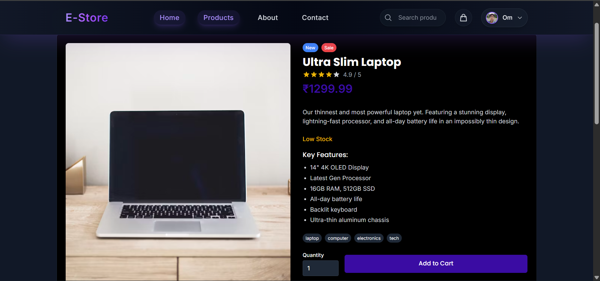
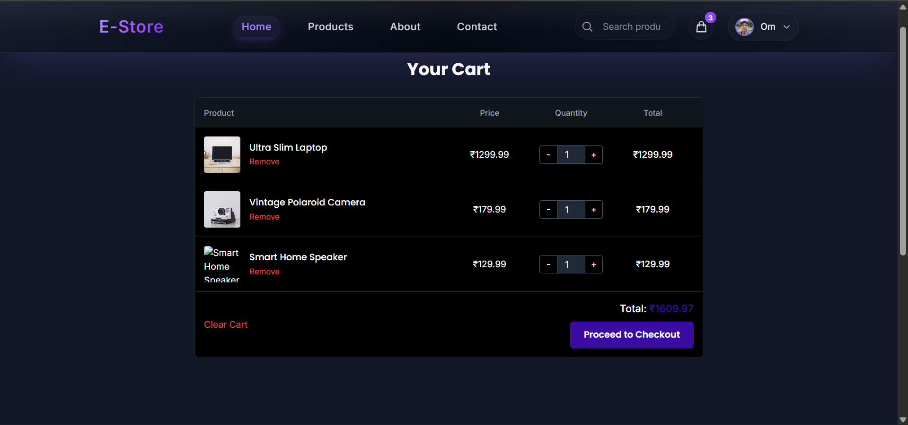
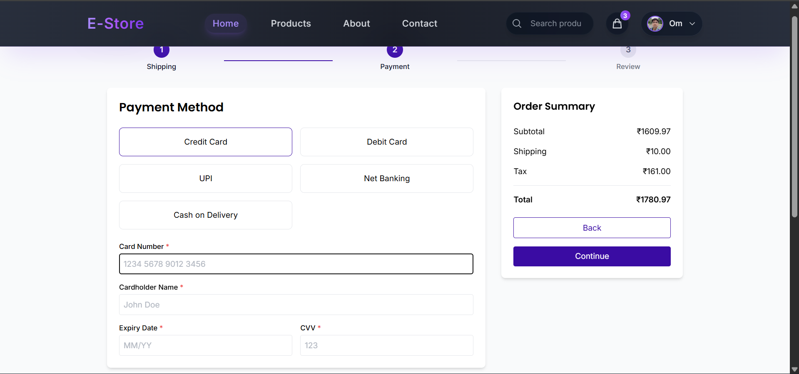
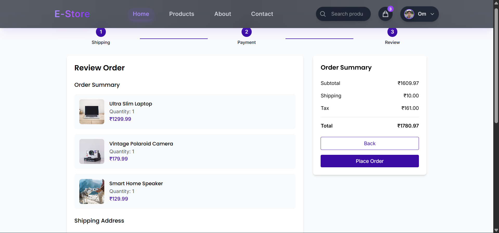
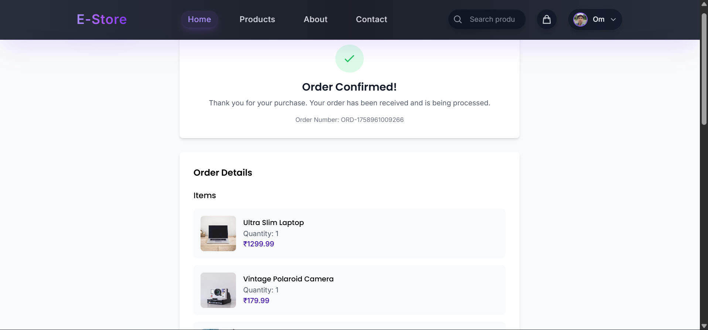
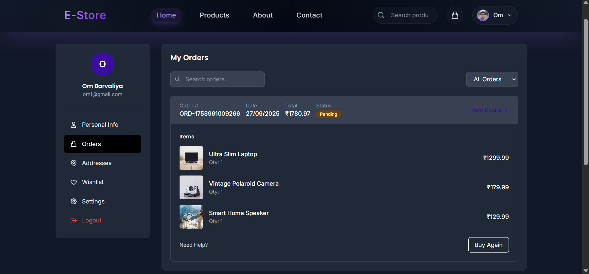
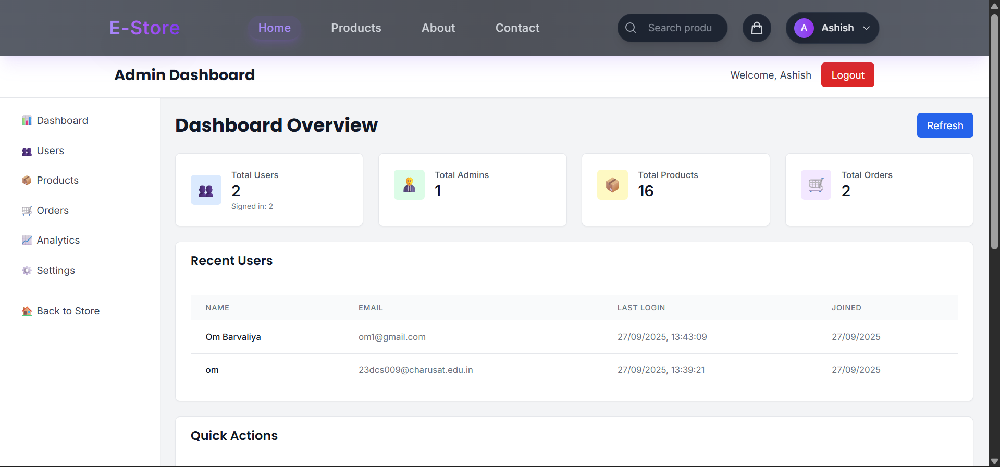
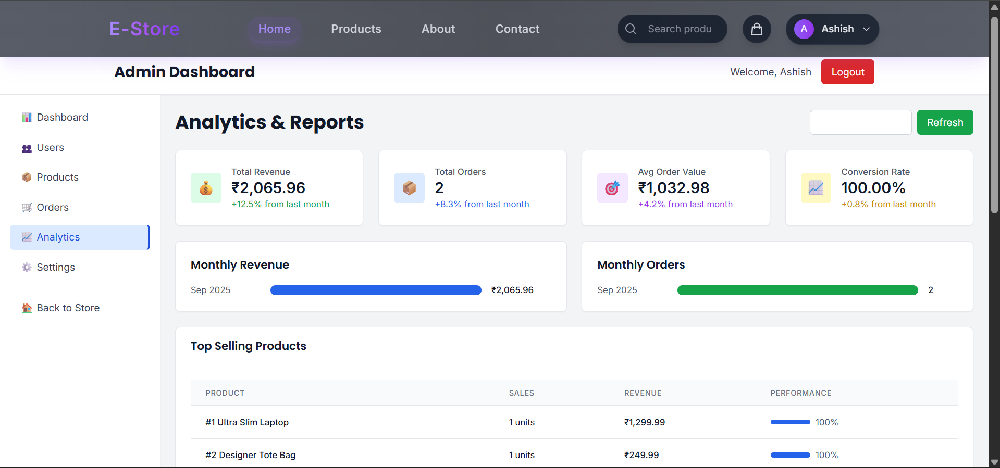
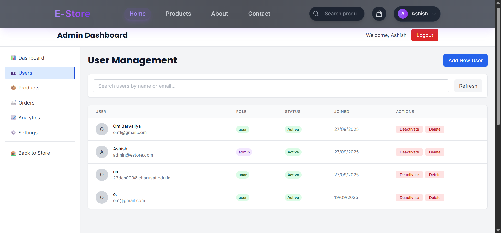

# 🛒 E-Store - Modern E-Commerce Platform

<div align="center">


**A modern, full-stack e-commerce platform built with React, TypeScript, and Node.js featuring a premium UI, smooth animations, and comprehensive admin functionality.**

</div>

---


## 👥 Collaborators

<table>
  <tr>
    <td align="center">
      <a href="https://github.com/ombarvaliya">
        
        <br />
        <sub><b>Om Barvaliya</b></sub>
      </a>
    </td>
    <td align="center">
      <a href="https://github.com/ashish2656">
        
        <br />
        <sub><b>Ashish Dodiya</b></sub>
      </a>
    </td>
    <td align="center">
      <a href="https://github.com/PAVAN-DEVMURARI">
        
        <br />
        <sub><b>Pavan Devmurari</b></sub>
      </a>
    </td>
    <td align="center">
      <a href="https://github.com/purvik152">
        
        <br />
        <sub><b>Purvik Anghan</b></sub>
      </a>
    </td>
  </tr>
</table> 

---

## 🎯 Project Overview

**E-Store** is a modern, full-stack e-commerce platform that provides a seamless shopping experience with a premium UI/UX design. Built with cutting-edge technologies, it features a sleek dark-themed design, smooth Framer Motion animations, and comprehensive admin functionality.

### ✨ Key Features

- 🎨 **Premium Dark-Themed UI** with violet and purple accents.
- 🎭 **Smooth Animations** powered by Framer Motion.
- 🛒 **Complete Shopping Cart** with real-time updates using React Context.
- 👤 **User Authentication** with JWT tokens and role-based access.
- 🔍 **Advanced Product Search** and filtering by category, price, and sale status.
- 📱 **Fully Responsive** design for all devices.
- 👨‍💼 **Admin Dashboard** for product, order, and user management.
- 📊 **Order Tracking** and history for users.
- ❤️ **Wishlist Functionality** for saving favorite items.

---

## ⚡ Tech Stack

### 🎨 Frontend
- **React 18.2.0**: A modern UI library for building user interfaces.
- **TypeScript 4.9.5**: For type-safe development.
- **Tailwind CSS 3.3.1**: A utility-first CSS framework for rapid UI development.
- **Framer Motion 10.16.4**: An animation library for smooth and beautiful animations.
- **React Router DOM 6.15.0**: For client-side routing.
- **Redux Toolkit 1.9.5**: For state management, particularly for theme state.
- **Axios 1.5.0**: An HTTP client for making requests to the backend.

### 🚀 Backend
- **Node.js**: A JavaScript runtime environment for the server-side.
- **Express.js**: A web framework for Node.js.
- **MongoDB**: A NoSQL database for storing user, product, and order data.
- **Mongoose**: An object modeling tool for MongoDB.
- **JWT (JSON Web Tokens)**: For secure user authentication.
- **bcryptjs**: For password hashing and security.
- **CORS**: For enabling cross-origin resource sharing.

### 🛠️ Development Tools
- **Nodemon**: For automatically restarting the server during development.
- **PostCSS**: A tool for transforming CSS with JavaScript.
- **Autoprefixer**: A PostCSS plugin to add vendor prefixes to CSS rules.

---

## 🏗️ Project Structure


# 🛒 E-Store

A **modern e-commerce platform** built with **React**, **TypeScript**, **Redux**, and **Node.js/Express**.  
This project features a fully responsive frontend, an admin dashboard, user authentication, shopping cart, and API-driven backend.

---

## 📂 Project Structure

```plaintext
innovgujju_webwizard2025/
├── public/             # Static assets (images, favicon, etc.)
├── src/                # Frontend source code
│   ├── components/     # Reusable UI components
│   │   ├── admin/      # Admin-specific components (AdminLayout, AdminSidebar)
│   │   ├── common/     # Shared components (PasswordInput, Button, etc.)
│   │   ├── icons/      # Icon components
│   │   ├── layout/     # Layout components (Header, Footer, Navbar)
│   │   └── product/    # Product-related components (Card, Detail)
│   ├── context/        # React Context providers
│   │   ├── AuthContext.tsx  # Authentication state
│   │   └── CartContext.tsx  # Shopping cart state
│   ├── pages/          # Page components
│   │   ├── admin/      # Admin dashboard pages
│   │   ├── HomePage.tsx     # Landing page
│   │   ├── ProductsPage.tsx # Product listing page
│   │   └── ...other user-facing pages
│   ├── store/          # Redux store
│   │   ├── slices/     # Redux slices (cartSlice, themeSlice)
│   │   └── store.ts    # Store configuration
│   └── types/          # TypeScript type definitions
├── server/             # Backend source code
│   ├── models/         # Database models (User, Order, Product)
│   ├── routes/         # API routes (admin, orders, products)
│   ├── middleware/     # Express middleware (auth)
│   └── server.js       # Express server entry point
└── package.json        # Project dependencies and scripts
```

## 👤 User Journey

### 🏠 **Landing Experience**
- 🏠 Homepage → 🛍️ Browse Products → 🔍 Search/Filter → 📱 Product Details

### 🔐 **Authentication Flow**
- 👤 Login/Register → ✅ View Dashboard & Manage Profile

### 🛒 **Shopping Experience**
- 🛍️ Browse → 🛒 Add to Cart → 💳 Checkout → 📧 Order Confirmation

### 👨‍💼 **Admin Workflow**
- 🔐 Admin Login → 📊 Dashboard → 📦 Manage Products/Users → 📋 View Orders

---

## 📱 Pages & Components

### 🏠 **Core Pages**
<details>
<summary><strong>🏠 Homepage</strong></summary>

- **Hero Section**: A large, welcoming hero section with a call-to-action to "Shop Now".
- **Shop by Category**: A grid of categories to allow users to easily navigate to the products they are interested in.
- **Featured Products**: A section showcasing handpicked featured products.

</details>

<details>
<summary><strong>🛍️ Products Page</strong></summary>

- **Advanced Filtering**: Filter products by category and sale status.
- **Search Functionality**: A search bar to find products by name, description, or category.
- **Sorting Options**: Sort products by price (low to high, high to low) and newest arrivals.
- **Product Grid**: A responsive grid displaying all the products.

</details>

<details>
<summary><strong>🛒 Shopping Cart</strong></summary>

- **Real-time Cart Updates**: Add, remove, and update product quantities with real-time total price calculation.
- **Clear Cart**: Option to clear the entire cart.
- **Proceed to Checkout**: A clear call-to-action to proceed to the checkout page.

</details>

<details>
<summary><strong>💳 Checkout Process</strong></summary>

- **Multi-step Checkout**: A guided three-step process for Shipping, Payment, and Review.
- **Address Management**: Users can select from their saved addresses.
- **Multiple Payment Methods**: Supports Credit Card, Debit Card, UPI, Net Banking, and Cash on Delivery.
- **Order Summary**: A persistent summary of the order total.

</details>

---

## 🔐 Authentication System

### 🛡️ **Security Features**

- **JWT Token Authentication**: Secure user authentication using JSON Web Tokens. The token is stored in local storage and sent with each request.
- **Password Hashing**: Passwords are securely hashed using `bcryptjs` before being stored in the database.
- **Role-Based Access Control**: The system differentiates between regular users and administrators. Admin-only routes and API endpoints are protected.
- **Protected Routes**: Both frontend and backend routes are protected to ensure that only authenticated (and authorized) users can access certain resources.

### 👤 **User Roles**

<details>
<summary><strong>👤 Regular User</strong></summary>

- Browse and search for products.
- Add items to the cart and wishlist.
- Complete the checkout process.
- View order history and manage their profile.

</details>

<details>
<summary><strong>👨‍💼 Admin User</strong></summary>

- Access a separate admin dashboard.
- Manage products (CRUD operations).
- View and manage all user accounts.
- View and process all customer orders.
- View analytics and reports.

</details>

---

## 🚀 Setup & Installation

### 📋 **Prerequisites**

- **Node.js** (v16.0.0 or higher)
- **npm** or **yarn**
- **MongoDB** (local or a cloud instance like MongoDB Atlas)

### 🛠️ **Installation Steps**

<details>
<summary><strong>1. Clone the Repository</strong></summary>


git clone [https://github.com/your-username/ecommerce-store.git](https://github.com/ombarvaliya/InnovGujju_WebWizard2025.git)
cd ecommerce-store
</details>

<details>
<summary><strong>2. Install Dependencies</strong></summary>

Bash

# Install frontend dependencies
npm install

# Install backend dependencies
cd server
npm install
cd ..
</details>

<details>
<summary><strong>3. Environment Configuration</strong></summary>

Create a .env file in the root directory and in the server directory with the following content:

Root .env file:

Code snippet

REACT_APP_API_URL=http://localhost:5000/api
server/.env file:

Code snippet

MONGODB_URI=mongodb://localhost:27017/ecommerce-store
JWT_SECRET=your-super-secret-jwt-key
PORT=5000
</details>

<details>
<summary><strong>4. Run the Application</strong></summary>

Bash

# Start the backend server (from the root directory)
npm run server

# In a new terminal, start the frontend (from the root directory)
npm start
The application will be available at:

Frontend: http://localhost:3000

Backend API: http://localhost:5000

</details>

<details>
<summary><strong>5. Create an Admin User</strong></summary>

To access the admin panel, you need to create an admin user. Run the following command from the server directory:

Bash

node createAdmin.js
This will create a default admin user with the following credentials:

Email: admin@estore.com

Password: admin123

</details>


# 🛒 InnovGujju WebWizard 2025

A **modern e-commerce platform** built with **React**, **TypeScript**, **Redux**, and **Node.js/Express**. Fully responsive, with a smooth user experience and admin dashboard.

---

## 📸 Screenshots

### 🏠 Homepage
  
Modern homepage featuring a dark theme, violet accents, and a prominent call-to-action.

### 🛍️ Products Page
  
Comprehensive products page with advanced filtering, search functionality, and a responsive grid layout.

### 📱 Product Detail
  
Detailed product view with high-resolution images, specifications, and an "Add to Cart" button.

### 🛒 Shopping Cart
  
Interactive shopping cart with real-time updates, quantity adjustments, and a clear checkout button.

### 💳 Checkout Process
  
Streamlined multi-step checkout process:  
- Shipping address step  
- Payment method selection (credit card, debit card, UPI, etc.)  
- Final order review before placing the order
  


### ✅ Order Confirmation
  
Order confirmation page displaying a success message and order details.

### 👤 User Profile & Orders
  
User profile page with personal information, sidebar for managing orders, addresses, and more.  
Order history page displaying past orders with details and status.

### 👨‍💼 Admin Dashboard

*Admin dashboard with an overview of total users, products, orders, and recent activity.*

### 📊 Admin Analytics

*Detailed analytics with reports on revenue, orders, AOV, and top-selling products.*

### 👥 Admin User Management

*User management interface for viewing, searching, and managing all user accounts.*

---

## 🤝 Contributing

Contributions are welcome! Please follow these steps:

1. Fork the repository.  
2. Create a new branch:  
```bash
git checkout -b feature/your-feature-name
